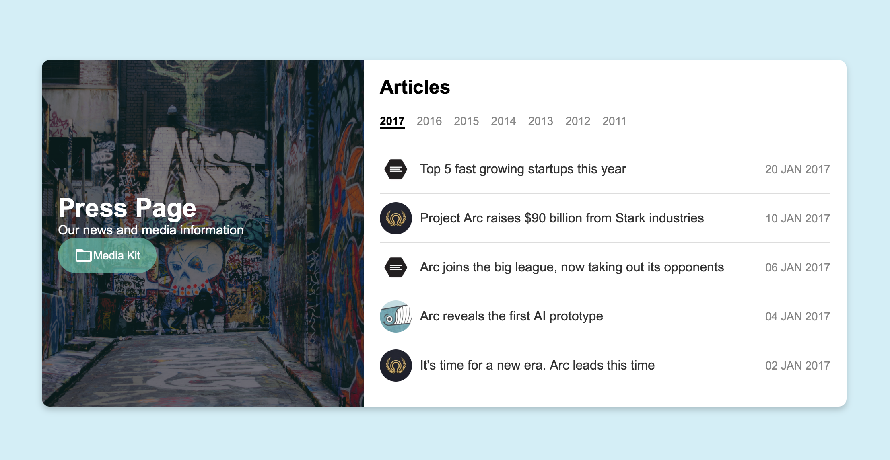

# Frontend Development Course Project

## Описание проекта

Этот проект был создан в рамках курса по фронтенд разработке. Цель проекта - продемонстрировать умения в верстке веб-страниц с использованием HTML и CSS, а также базовые навыки в JavaScript. Проект включает страницу с фотографией "до" и "после" применения CSS-стилей.

## Структура проекта

- `index.html`: Основной HTML файл.
- `style.css`: Файл со стилями CSS.
- `images/`: Папка с изображениями.

## Установка и запуск

### Шаги для установки

1. Склонируйте репозиторий:
    ```bash
    git clone https://github.com/git-aidai-kydykbekova/midterm_project.git
    ```

2. Перейдите в директорию проекта:
    ```bash
    cd frontend-course-project
    ```

### Запуск проекта

Откройте файл `index.html` в вашем веб-браузере.

## Пример использования

### До применения CSS



### После применения CSS


## Используемые технологии

- HTML5
- CSS3
- JavaScript (базовый уровень)

## Лицензия

Этот проект лицензирован на условиях MIT License. Подробности смотрите в файле [LICENSE](LICENSE).

## Автор

Ваше Имя - [ваш контакт или профиль на GitHub](https://github.com/yourusername)

